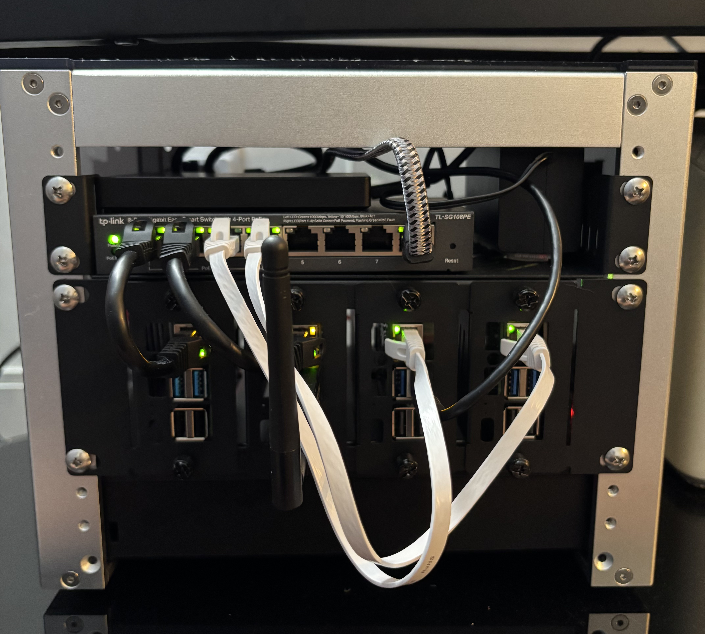
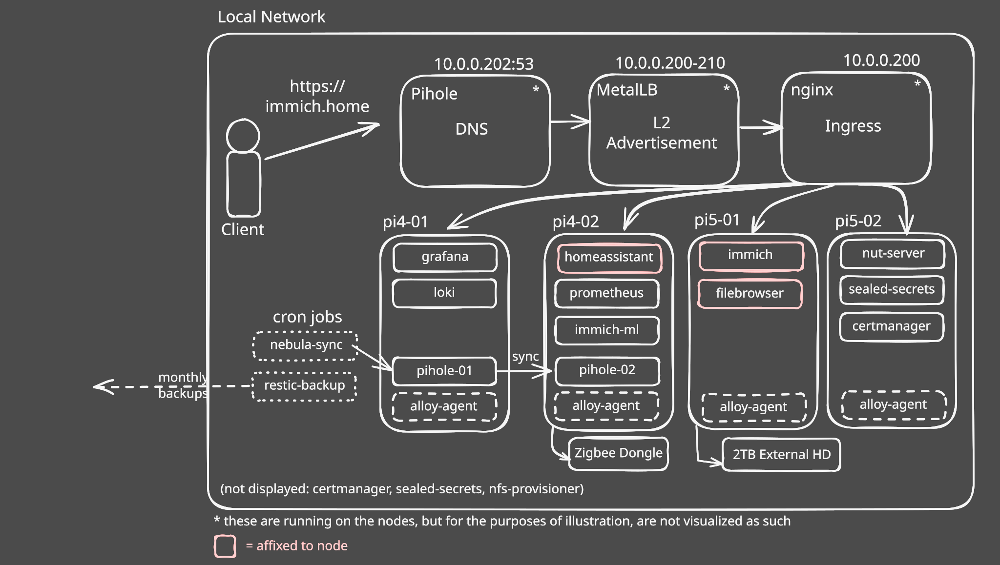
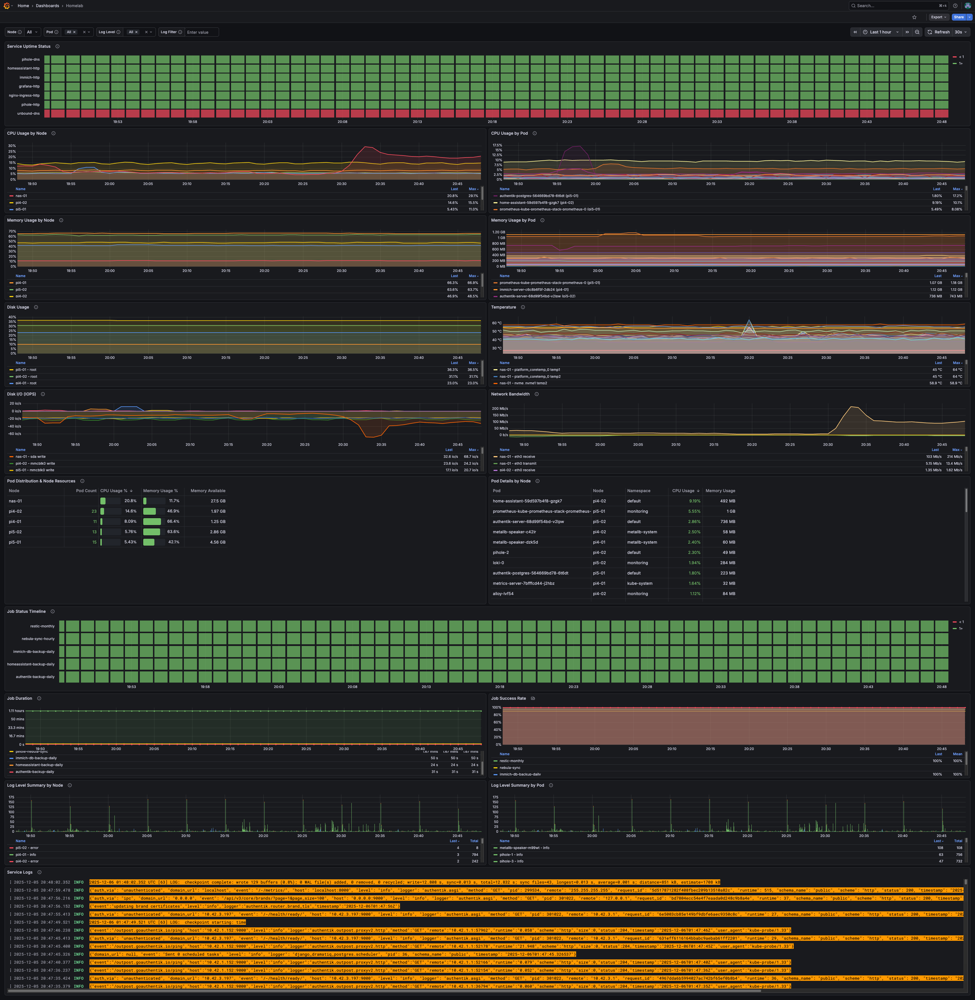

# homelab-k8s ☸️

A 4-node HA Kubernetes cluster on Raspberry Pi hardware running self-hosted services with automated backups.

## features 🚀
1. highly-available pods (for the most part 😅)
2. dns server w/ ad-blocking via pihole (4 replicas, synced via nebula-sync)
3. graceful shutdown in the event of a power outage
> my setup is a bit scuffed because my UPS does not have a direct connection to monitor its status, so instead I have an automation in Home Assistant to safe shutdown
4. SSO via Authentik across services
5. automated backups to Backblaze B2 (photos, databases, configs)
6. GitOps-style CI/CD — push to `main` auto-deploys changed charts

## hardware ⚙️

- `pi4-01` (4GB RAM w/ [PoE+ Hat](https://www.raspberrypi.com/products/poe-plus-hat/)): Control plane + lightweight services
- `pi4-02` (4GB RAM w/ [PoE+ Hat](https://www.raspberrypi.com/products/poe-plus-hat/)): Control plane + Zigbee worker (Home Assistant)
- `pi5-01` (8GB RAM w/ [PoE+ Hat](https://www.raspberrypi.com/products/poe-plus-hat/)): Control plane + storage worker with HDD
- `pi5-02` (8GB RAM w/ [PoE+ Hat](https://www.raspberrypi.com/products/poe-plus-hat/)): Control plane + [NUT-like server](https://networkupstools.org/index.html)
  

<br/>

Case: [DeskPi T1 Rackmate](https://deskpi.com/products/deskpi-rackmate-t1-2)

Pi Mount: [DeskPi 2U Rack Mount](https://deskpi.com/products/deskpi-rackmate-10-inch-2u-rack-mount-with-pcie-nvme-board-for-raspberry-pi-5-4b)

Network Switch: [TP-Link 8-Port Gigabit Easy Smart Switch with 4-Port PoE+](https://www.tp-link.com/us/business-networking/poe-switch/tl-sg108pe/)

Uninterruptible Power Supply (UPS): [Tripp Lite Standby UPS](https://tripplite.eaton.com/standby-ups-600va-300w-4-outlets-120v-energy-star~BC600R)

Zigbee Coordinator: [SONOFF Zigbee 3.0 USB Dongle Plus | ZBDongle-P](https://sonoff.tech/products/sonoff-zigbee-3-0-usb-dongle-plus-zbdongle-p)

## architecture 🗺️


<br/>

**services:**
- **immich** — Photo management with ML (https://img.jarrodservilla.com)
- **home-assistant** — Home automation with Zigbee (https://homeassistant.jarrodservilla.com)
- **pihole** — DNS + ad blocking, 4 HA replicas (10.2.1.202 / https://pi.jarrodservilla.com)
- **authentik** — SSO/identity provider (https://auth.jarrodservilla.com)
- **nas-services** — Ingress routing to NAS apps (Jellyfin, Radarr, Sonarr, qBittorrent, etc.)

**infra:**
- **nginx-ingress** — Reverse proxy with TLS (10.2.1.200)
- **metallb** — LoadBalancer implementation
- **cert-manager** — Automatic TLS certificates
- **sealed-secrets** — Encrypted secrets in Git
- **network-policies** — Default-deny egress/ingress rules

**monitoring:**
- **kube-prometheus-stack** — Prometheus + Grafana (https://grafana.jarrodservilla.com)
- **loki** — Log aggregation (SingleBinary mode, 72h retention)
- **alloy** — DaemonSet log and metrics collection agent
- **prometheus-blackbox-exporter** — HTTP/DNS/ICMP health probes

**backups** (CronJobs to Backblaze B2):
- **restic-backup** — Monthly NAS files/library
- **immich-db-backup** — Daily PostgreSQL dump
- **home-assistant-backup** — Daily config snapshot
- **authentik-backup** — Authentik data backup



## getting started ✅

### 1. k3s cluster setup

```bash
# Pi 4 #1 (first control plane)
curl -sfL https://get.k3s.io | sh -s - server --cluster-init --disable traefik
sudo cat /var/lib/rancher/k3s/server/node-token  # Get token for other nodes

# Pi 4 #2 (control plane + Zigbee)
curl -sfL https://get.k3s.io | sh -s - server \
  --server https://<pi4-1-ip>:6443 --token <token> \
  --disable traefik --disable servicelb --node-label zigbee=true

sudo -E rpi-eeprom-config --edit
# set BOOT_ORDER=0x1 (sd card only)

# Pi 5 #1 (control plane + storage) - Mount HDD at /mnt/hd1 first
curl -sfL https://get.k3s.io | sh -s - server \
  --server https://<pi4-1-ip>:6443 --token <token> \
  --disable traefik --disable servicelb --node-label storage=true


# Pi 5 #2 (control plane + NUT)
curl -sfL https://get.k3s.io | sh -s - server \
  --server https://<pi4-1-ip>:6443 --token <TOKEN> \
  --disable traefik \
  --disable servicelb
```

### 2. tool setup 🛠️

```bash
make setup-repos         # Add Helm repos
make build-deps          # Build chart dependencies
make install-infra       # Install MetalLB, cert-manager, nginx-ingress, etc.
make install-monitoring  # Install Prometheus, Grafana, Loki, Alloy
make deploy-all          # Deploy all application services
```

**Or install everything at once:**
```bash
make install-all  # Runs all setup commands sequentially
```

## runbooks 📓

- [POWER_OUTAGE](docs/runbooks/POWER_OUTAGE.md) — graceful shutdown + power-up sequence
- [ISP_MIGRATION](docs/runbooks/ISP_MIGRATION.md) — pre-flight, decision tree, cutover, and external IP audit for switching ISPs / routers

## troubleshooting 🕵️

- **Pods pending:** Check PVC status (`kubectl get pvc`), node labels, and resources
- **LoadBalancer pending:** Verify MetalLB is running and has available IPs
- **Ingress 404:** Ensure cert-manager has issued certificates and ingress rules are correct
- **Grafana not loading:** Check ingress and TLS certificate: `kubectl get ingress -n monitoring`
- **Missing metrics:** Verify ServiceMonitors exist: `kubectl get servicemonitor -n monitoring`
- **NFS mount issues:** Check NFS server exports and client packages on all nodes